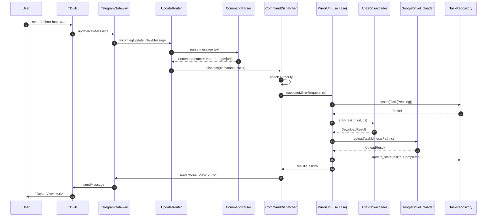
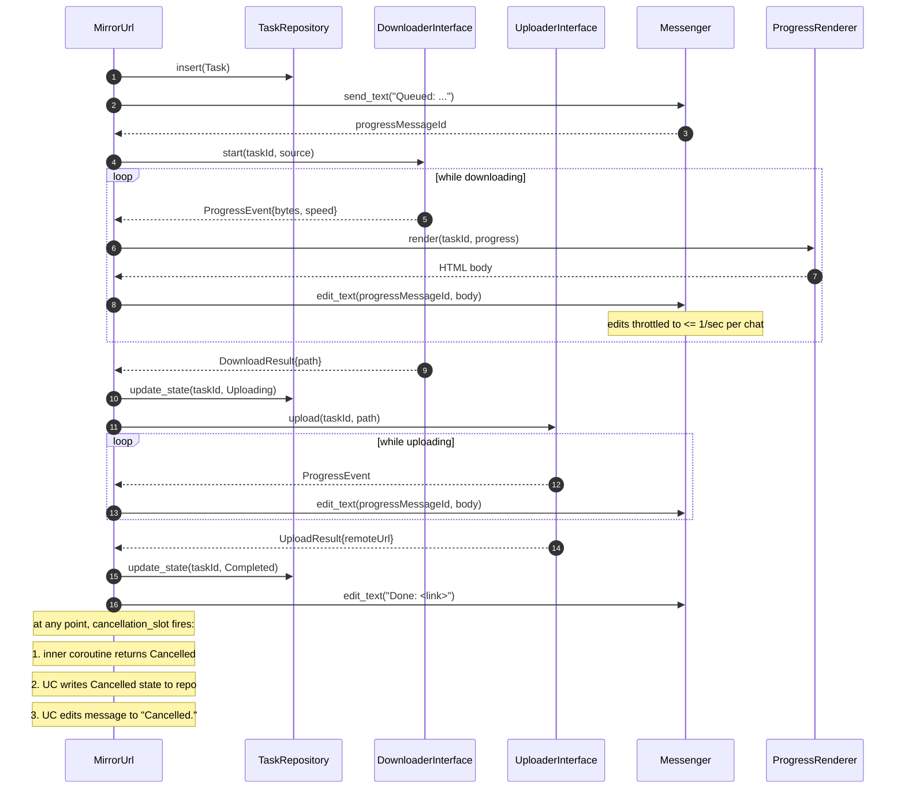

# CMLB architecture

This document is the authoritative architectural overview of CMLB. It is meant for two audiences: contributors who need to find the right place to add a feature, and reviewers who need to confirm that a proposed change does not break a layering invariant.

Cross-references:
- [`adr/0001-async-model-asio-coroutines.md`](adr/0001-async-model-asio-coroutines.md)
- [`adr/0002-persistence-sqlite-wal.md`](adr/0002-persistence-sqlite-wal.md)
- [`adr/0003-telegram-gateway-isolation.md`](adr/0003-telegram-gateway-isolation.md)
- [`adr/0004-build-system-vcpkg-manifest.md`](adr/0004-build-system-vcpkg-manifest.md)
- [`adr/0005-warnings-as-errors-symmetric.md`](adr/0005-warnings-as-errors-symmetric.md)
- [`adr/0006-no-i-prefix-naming.md`](adr/0006-no-i-prefix-naming.md)
- [`adr/0007-performance-tuning.md`](adr/0007-performance-tuning.md)
- [`adr/0008-error-model-result-and-app-error.md`](adr/0008-error-model-result-and-app-error.md)
- [`adr/0009-five-layer-ddd-layering.md`](adr/0009-five-layer-ddd-layering.md)
- [`adr/0010-security-boundary-and-credential-handling.md`](adr/0010-security-boundary-and-credential-handling.md)
- [`adr/0011-forward-only-schema-migrations.md`](adr/0011-forward-only-schema-migrations.md)

---

## Table of contents

- [Overview](#overview)
- [Layer-by-layer description](#layer-by-layer-description)
  - [Core](#core)
  - [Domain](#domain)
  - [Application](#application)
  - [Infrastructure](#infrastructure)
  - [Presentation](#presentation)
- [Async model](#async-model)
- [TelegramGateway isolation](#telegramgateway-isolation)
- [Persistence design](#persistence-design)
- [Threading model](#threading-model)
- [Dataflow diagrams](#dataflow-diagrams)
  - [Command lifecycle](#command-lifecycle)
  - [Mirror lifecycle](#mirror-lifecycle)
- [Error model](#error-model)
- [Configuration](#configuration)
- [Observability](#observability)

---

## Overview

CMLB is a strict five-layer Domain-Driven Design application:

```
+---------------------------------------------------+
| presentation/   command parsing + rendering       |
+---------------------------------------------------+
| application/    use cases (verb-noun)             |
+---------------------------------------------------+
| domain/         entities, value objects, policies |
+---------------------------------------------------+
| infrastructure/ adapters to TDLib, aria2, SQLite, |
|                 Google Drive, rclone, ffmpeg, 7z  |
+---------------------------------------------------+
| core/           Result<T>, Logger, Executor, ...  |
+---------------------------------------------------+
```

Dependency rules are enforced by `CMakeLists.txt` target_link visibility and by clang-tidy include-checks:

- `core/` depends on nothing project-internal.
- `domain/` depends on `core/` only.
- `application/` depends on `domain/` and `core/`. It declares *interfaces* for everything it needs from infrastructure (`DownloaderInterface`, `UploaderInterface`, `TaskRepository`, ...) but never includes the concrete adapter.
- `infrastructure/` implements those interfaces. It may depend on `application`, `domain`, and `core`. The reverse — `application` depending on `infrastructure` — is a compile-time error.
- `presentation/` is the outermost layer. It wires use cases to commands and renders responses. It depends on `application` and `domain` but not on `infrastructure` directly; concrete adapters are injected by the composition root in `src/main.cpp`.

A correct mental model: the dependency graph is a tree rooted at `core`, with `presentation` at the top, and `infrastructure` as a sibling branch off `application` that fulfils application's port interfaces.

---

## Layer-by-layer description

### Core

`core/` provides primitives that the rest of the project relies on. Components:

- **`Result<T>`** — an `expected`-shaped sum type with a structured `Error` payload (code, message, optional cause). Used as the return type of every fallible operation. See [Error model](#error-model).
- **`Logger`** — a thin wrapper around spdlog that exposes leveled logging, optional structured fields (`with("task_id", tid)`), and a rotating-file sink plus stderr.
- **`Configuration`** — parsed `config.json` with strong-typed access (`config.telegram().api_id()` returns `ApiId`, not raw `int`). Loaded once at startup; immutable thereafter.
- **`Executor`** — owns the shared `boost::asio::io_context`, runs the worker thread pool, and exposes a strand factory. Use cases never reach for `io_context` directly; they accept `Executor&`.
- **`Cancellation`** — convenience wrappers around `asio::cancellation_signal` and `asio::cancellation_slot` so use cases can propagate cancellation without dragging Asio headers everywhere.
- **`Formatting`** — fmt-based helpers: human-readable byte sizes (`ByteSize::format()`), durations, percentages, ETA.

Key files: `include/core/result.hpp`, `include/core/logger.hpp`, `include/core/config.hpp`, `include/core/executor.hpp`.

### Domain

`domain/` is the business model. It is pure C++23 with no I/O, no Asio, no spdlog. You can compile `domain/` for any target on any platform with no external dependencies beyond the C++ standard library and `fmt`. Components:

- **Strong-typed identifiers** — `ChatId`, `UserId`, `Gid` (aria2's task id), `TaskId` (CMLB's own task id). All wrap a primitive integer in a class with explicit conversion to avoid `int` confusion.
- **`Authority`** — the permission model. `Authority::Anyone`, `::User`, `::Admin`, `::Owner` with monotonic ordering. Use cases declare `required_authority()` and the dispatcher rejects calls below the threshold.
- **`Task` aggregate** — the central business entity. Has an `id`, an `owner`, a `source` (URL/magnet/file), a `destination` (`UploadDestination::Telegram | Drive | Rclone`), a state machine, accumulated progress, and an optional error. The state machine is enforced inside `Task` — invalid transitions return `Result<void>` with `ErrorCode::InvalidStateTransition`.
- **`ByteSize`** — a value type for bytes with formatted output. Used everywhere a raw `uint64_t` would otherwise be passed.
- **`UploadDestination`** — discriminated union of upload targets.

Task states:

```
   Pending --> Downloading --> Processing --> Uploading --> Completed
       \           |              |              |
        \--------> Cancelled <----+--------------+
                   |
                   +-> Failed
```

Key files: `include/domain/task.hpp`, `include/domain/authority.hpp`, `include/domain/identifiers.hpp`, `include/domain/byte_size.hpp`.

### Application

`application/` contains the use cases. Each use case is a single class with a single async entry point named for what it does in business terms. The file and class names are verb-noun:

- `MirrorUrl` — fetch a URL or magnet and upload to the configured remote destination.
- `LeechUrl` — fetch and upload back to Telegram.
- `CloneDriveResource` — server-side clone within Google Drive.
- `CountDriveResource` — count files / bytes under a Drive node.
- `DeleteDriveResource` — delete a Drive node.
- `CancelTask`, `PauseTask`, `ResumeTask` — task lifecycle control.
- `UpdateUserSettings`, `UpdateBotSettings` — per-user and global settings mutators.
- `AddRssSubscription`, `RemoveRssSubscription`, `ListRssSubscriptions` — RSS management.

Each use case constructor takes the *ports* it needs:

```cpp
class MirrorUrl {
public:
    MirrorUrl(DownloaderInterface& downloader,
              UploaderInterface& uploader,
              TaskRepository& tasks,
              MessengerInterface& messenger,
              Logger& log);

    awaitable<Result<TaskId>> execute(MirrorRequest req,
                                      asio::cancellation_slot cs);
};
```

Use cases hold the messenger via its abstract `MessengerInterface` so tests can swap in a recording stub. Only the composition root (`src/main.cpp`) instantiates the concrete `Messenger` that forwards to the `TelegramGateway`.

Use cases compose smaller domain operations and adapter calls; they never include adapter headers. They are the *only* place where multi-step business logic lives.

Key files: `include/application/mirror_url.hpp`, `include/application/leech_url.hpp`, `include/application/cancel_task.hpp`, etc.

### Infrastructure

`infrastructure/` is where the messy outside world is mediated. Each adapter implements a port interface declared in `application` or `domain`. Components:

- **`TelegramGateway`** — sole owner of the TDLib client. Translates between TDLib's JSON updates and the project's typed `IncomingUpdate` variant. See [TelegramGateway isolation](#telegramgateway-isolation).
- **`Messenger`** — fluent send/edit interface used by use cases. Wraps the gateway. Throttles edits to respect Telegram's per-chat rate limits.
- **`UpdateRouter`** — receives updates from the gateway, classifies them (command, callback, file upload, ...), and dispatches to the appropriate handler.
- **`AuthenticationFlow`** — drives TDLib through `setTdlibParameters`, `checkDatabaseEncryptionKey`, `checkAuthenticationBotToken` (or phone+code flow for user accounts).
- **`Aria2Downloader`** — implements `DownloaderInterface` over aria2's WebSocket JSON-RPC. Maintains a single persistent connection, multiplexes RPC calls by request id, and translates aria2 notifications into progress events.
- **`QbittorrentDownloader`** — implements `DownloaderInterface` over qBittorrent's Web API (`/api/v2/torrents/...`). Logs in once, retains the session cookie, refreshes on 401.
- **`TelegramUploader`** — implements `UploaderInterface` for Telegram chats. Handles the 2 GB / 4 GB premium split logic.
- **`GoogleDriveUploader`** — implements `UploaderInterface` for Drive. Signs a JWT, exchanges it for an access token, uses resumable upload sessions for large files.
- **`RcloneUploader`** — subprocess wrapper around `rclone copy --progress`.
- **`SqliteConnectionPool`** — small pool of SQLite connections (WAL mode means readers don't block writers, but having multiple connections still helps under load).
- **`SchemaMigrator`** — runs forward-only versioned migrations from `migrations/` at startup.
- **`TaskRepository`**, **`UserSettingsRepository`**, **`BotSettingsRepository`**, **`RssFeedRepository`** — one repository per aggregate. Repositories return domain types and accept domain types; they never expose `sqlite_modern_cpp` types.
- **`FfmpegMediaProcessor`** — generates thumbnails, samples, and extracts metadata via the `ffmpeg` and `ffprobe` subprocesses.
- **`SevenZipArchiveProcessor`** — extract and compress via the `7z` subprocess.
- **`RssFeedPoller`** — schedules per-feed polls based on configured interval.
- **`RssDocumentParser`** — parses Atom and RSS 2.0 documents into typed feed entries.
- **`BeastHttpClient`** — Boost.Beast-based HTTPS client used by anything that talks plain HTTP (Google APIs, RSS, qBittorrent Web API).
- **`Subprocess`** — RAII wrapper around `boost::process` (v2) for clean child-process management with cancellation.
- **`SystemMetrics`** — CPU / RAM / disk / uptime sampling for `/stats`.

Key files: `include/infrastructure/telegram_gateway.hpp`, `include/infrastructure/aria2_downloader.hpp`, `include/infrastructure/google_drive_uploader.hpp`, etc.

### Presentation

`presentation/` is the thinnest layer. It exists to keep parsing and rendering out of the use cases. Components:

- **`CommandParser`** — tokenizes a Telegram message into `(command, args, flags)`. Knows about quoting and `--flag value` parsing.
- **`CommandDispatcher`** — owns the registry of `{name -> use case}` bindings. Resolves the caller's `Authority`, checks it against the command's requirement, and calls the use case.
- **`CallbackDispatcher`** — handles inline-keyboard callbacks (`/settings` panel, confirmation dialogs).
- **`HtmlRenderer`** — escapes and formats outgoing message HTML.
- **`ProgressRenderer`** — produces the progress-message body: bar, percentage, speed, ETA. Throttles edits in cooperation with `Messenger`.

Key files: `include/presentation/command_parser.hpp`, `include/presentation/command_dispatcher.hpp`, `include/presentation/progress_renderer.hpp`.

---

## Async model

CMLB uses Boost.Asio C++20 coroutines exclusively. Every function that performs I/O — sending a message, downloading a file, querying the database, executing a subprocess — has this shape:

```cpp
asio::awaitable<Result<SomeType>> operation(Args... args, asio::cancellation_slot cs);
```

Three things to notice:

1. **`awaitable<Result<T>>`**, not `awaitable<T>`. Failures are values, not exceptions. The coroutine reaches its co_return statement on both success and failure; the caller `co_await`s it and gets a `Result`. Exceptions are reserved for genuinely unrecoverable problems (out-of-memory, broken invariants).
2. **`cancellation_slot` is explicit.** Every operation receives a slot that, when triggered, will abort the operation as quickly as it can. There is no global cancellation flag, no `std::atomic<bool> stop`, no thread interruption — every coroutine forwards its slot to whatever sub-operation it awaits next.
3. **The return value owns its resources.** No raw pointers escape; sockets, connections, file handles are managed by RAII objects that are members of the coroutine frame.

Use cases compose coroutines naturally:

```cpp
awaitable<Result<TaskId>> MirrorUrl::execute(MirrorRequest req, cancellation_slot cs) {
    auto task = co_await tasks_.create(req, cs);
    if (!task) co_return task.error();

    auto download = co_await downloader_.start(task->id(), req.source, cs);
    if (!download) {
        co_await tasks_.mark_failed(task->id(), download.error(), cs);
        co_return download.error();
    }

    auto upload = co_await uploader_.upload(task->id(), download->local_path, cs);
    if (!upload) {
        co_await tasks_.mark_failed(task->id(), upload.error(), cs);
        co_return upload.error();
    }

    co_await tasks_.mark_completed(task->id(), upload->remote_url, cs);
    co_return task->id();
}
```

The rationale for choosing Asio coroutines over `std::future`, callback APIs, or `std::execution` (sender/receiver) is in [ADR-0001](adr/0001-async-model-asio-coroutines.md).

---

## TelegramGateway isolation

TDLib is a C++ library that exposes about 1,500 generated types in `<td/telegram/td_api.h>`. Including that header is expensive (compile-time and incidentally in code reviewer attention) and contagious: once a `td_api::object_ptr` shows up in a header, every translation unit that includes that header pays the cost.

CMLB's response: exactly one file in the codebase is allowed to include `<td/telegram/td_api.h>` — `src/infrastructure/telegram_gateway.cpp`. The gateway:

1. Owns the `td::Client` instance.
2. Drives the TDLib update loop on a dedicated strand.
3. Translates TDLib's update objects into CMLB's own `IncomingUpdate` variant (a closed sum of `NewMessage`, `CallbackQuery`, `FileUploadProgress`, `AuthenticationState`, ...).
4. Translates outgoing requests (`SendText`, `EditText`, `SendDocument`, `DownloadFile`) into TDLib API calls.

Everything outside the gateway sees only CMLB types. The `Messenger` interface that use cases consume looks like:

```cpp
class Messenger {
public:
    virtual awaitable<Result<MessageId>> send_text(ChatId, std::string, asio::cancellation_slot) = 0;
    virtual awaitable<Result<void>> edit_text(ChatId, MessageId, std::string, asio::cancellation_slot) = 0;
    virtual awaitable<Result<MessageId>> send_document(ChatId, std::filesystem::path, asio::cancellation_slot) = 0;
    // ...
};
```

No TDLib symbol leaks through.

Enforcement:

- **clang-tidy** has a project-level `header-filter` rule that blocks `<td/telegram/td_api.h>` everywhere except `src/infrastructure/telegram_gateway.cpp`.
- **include-what-you-use** (IWYU) is run in a CI job and rejects new includes of TDLib outside the allowed file.
- **CMake** declares the TDLib dependency `PRIVATE` on a single target (`cmlb_infrastructure_telegram`), so an attempt to include it elsewhere won't even resolve the path.

The full rationale (and the alternatives considered) is in [ADR-0003](adr/0003-telegram-gateway-isolation.md).

---

## Persistence design

State that survives a restart lives in a single SQLite database at `data/cmlb.db`. The schema is owned by `migrations/V0001__initial_schema.sql`, `migrations/V0002__rss_feeds.sql`, and onward — strictly forward-only, never edited, never reordered.

Pragmas applied at every connection open:

```sql
PRAGMA journal_mode = WAL;
PRAGMA synchronous = NORMAL;
PRAGMA foreign_keys = ON;
PRAGMA temp_store = MEMORY;
PRAGMA mmap_size = 268435456;
```

WAL mode means concurrent readers do not block the single writer; `synchronous = NORMAL` is durable across application crashes but allows the OS to batch fsyncs.

Repositories follow the same shape:

```cpp
class TaskRepository {
public:
    virtual awaitable<Result<TaskId>> insert(const Task&, cancellation_slot) = 0;
    virtual awaitable<Result<Task>> find(TaskId, cancellation_slot) = 0;
    virtual awaitable<Result<std::vector<Task>>> find_active(cancellation_slot) = 0;
    virtual awaitable<Result<void>> update_state(TaskId, TaskState, cancellation_slot) = 0;
    // ...
};
```

A few key invariants:

- **One aggregate, one repository.** `TaskRepository` only deals with `Task`. There is no general-purpose `QueryRunner`.
- **Repositories return domain types.** Callers never see `sqlite::database` or `sqlite::row`. The translation between SQL rows and domain objects happens inside the repository.
- **Migrations are forward-only.** There is no rollback machinery. A bad migration is followed by a *new* migration that corrects it. See `infrastructure::SchemaMigrator`.
- **Writes are serialized through a single connection.** Concurrent reads use other connections from the pool.

The rationale for SQLite-over-everything-else is in [ADR-0002](adr/0002-persistence-sqlite-wal.md).

---

## Threading model

CMLB runs an `asio::io_context` with a small pool of worker threads (configurable; default is `std::thread::hardware_concurrency()` but capped at 8). All asynchronous work runs on those threads.

Two patterns keep the model sane:

1. **Strand-per-gateway.** Resources that aren't thread-safe (the TDLib client, an aria2 WebSocket session, a qBittorrent session) are wrapped in an `asio::strand`. All work touching that resource is dispatched to its strand, which serializes execution. This eliminates the need for explicit mutexes on the resource.
2. **No manual job queue.** Earlier mirror-bot designs ran a custom job queue with a custom thread pool. CMLB does not. The job queue is `io_context`; the thread pool is the worker pool. Cancellation, scheduling, and back-pressure are all handled by Asio idioms.

Tasks that are intrinsically blocking (subprocess wait, large filesystem traversal) are dispatched via `asio::post(co_await asio::this_coro::executor, ...)` to a dedicated `thread_pool` so they don't tie up coroutine workers. The `Executor` abstraction in `core/` exposes this as `executor.run_blocking(...)`.

---

## Dataflow diagrams

### Command lifecycle

What happens when a user sends `/mirror https://example.com/big.iso` in a chat:



### Mirror lifecycle

A zoomed-in view of the mirror use case itself, including progress edits and cancellation:



---

## Error model

Every fallible operation returns `Result<T>`. The `Error` payload has three fields:

```cpp
struct Error {
    ErrorCode code;
    std::string message;
    std::optional<std::unique_ptr<Error>> cause;
};
```

`ErrorCode` is an enum class with a closed taxonomy. The top-level groups:

| Group | Codes | Meaning |
|---|---|---|
| `Input*` | `InputInvalid`, `InputMissing`, `InputTooLarge` | Caller supplied bad data; not retryable without a fix. |
| `Auth*` | `AuthForbidden`, `AuthExpired`, `AuthRequired` | Caller is not allowed or session expired. |
| `State*` | `StateInvalidTransition`, `StateNotFound`, `StateConflict` | Domain rule rejected the operation. |
| `External*` | `ExternalUnavailable`, `ExternalTimeout`, `ExternalRateLimited`, `ExternalUnauthorized`, `ExternalQuotaExceeded` | A downstream service (TDLib, aria2, Drive) failed. Often retryable. |
| `Io*` | `IoNotFound`, `IoPermissionDenied`, `IoFull`, `IoCorrupted` | Filesystem or local I/O failure. |
| `Cancelled` | (singleton) | Operation was cancelled via its cancellation slot. |
| `Internal` | `InternalAssertion`, `InternalUnreachable` | A bug. Logged at error level with a stack trace if available. |

**Propagation rules:**

1. **Never bare-rethrow.** If a function catches `boost::system::system_error` it converts it to a `Result<>` error with a code from the table above and stashes the underlying error in `cause`.
2. **Wrap when adding context.** An upper-layer function that has more context than the layer below should set its own `Error` and chain the lower one as `cause`. The renderer walks the chain when producing the user-facing message.
3. **Never lose `Cancelled`.** A `Cancelled` always propagates as `Cancelled`. It is the one code that must not be reclassified.
4. **Translate at the boundary.** A repository converts SQLite error codes; an HTTP client converts Beast errors; a subprocess wrapper converts exit codes. The translation table lives next to the adapter.

This model is what makes `Result<T>` worthwhile compared to plain exceptions: error codes are programmatic, the rendering of an error to the user is centralized, and there is one obvious place to add retry policy (the `ExternalRateLimited` and `ExternalTimeout` codes are handled by a retry helper in `core/`).

---

## Configuration

Configuration is loaded once at startup. The load order is:

1. Parse `config.json` (path from `--config` flag or `CMLB_CONFIG_PATH` env var, defaults to `./config.json`).
2. For each field, check if the corresponding `CMLB_<UPPER_SNAKE>` environment variable is set; if so, override.
3. Validate. Validation **collects all errors** rather than stopping at the first one. If three fields are wrong, the operator gets a report of all three.
4. Construct an immutable `core::Configuration` and pass it down via dependency injection.

Validation produces a flat list of `ConfigurationError{field, message}`. The CLI flag `--validate-config` performs only steps 1-3 and exits 0 / non-zero based on the result; useful for pre-deploy checks and CI.

Reload-at-runtime is **not** supported in v1. Restart the bot to pick up config changes. The state on disk (SQLite, TDLib session, in-flight downloads on aria2) is unaffected by a restart, so this is cheap.

Field-level details live in [`configuration_reference.md`](configuration_reference.md).

---

## Observability

Two pillars: logging and (optional) metrics.

**Logging** uses spdlog with two sinks:

- A rotating-file sink at `paths.data / cmlb.log` (default), rotating at 10 MB with 5 historical files kept.
- A stderr sink for interactive runs.

Log lines are structured: every entry carries `{timestamp, level, logger_name, message, fields...}`. The format is human-readable by default; JSON mode is enabled by `logging.format = "json"` for ingestion into log aggregators.

Sensitive fields (bot token, API hash, service-account key) are redacted before logging. The redaction list is defined in `core/logger.cpp` and is symmetric across both sinks.

**Metrics** are off by default. When `metrics.enabled = true`, CMLB exposes a Prometheus scrape endpoint at `metrics.bind` (default `127.0.0.1:9464`). Counters and histograms include:

- `cmlb_tasks_total{state}` — counter by terminal state (`completed`, `failed`, `cancelled`).
- `cmlb_task_duration_seconds{kind}` — histogram by task kind (`mirror`, `leech`, `clone`).
- `cmlb_download_bytes_total{downloader}` — counter, sum of bytes downloaded.
- `cmlb_upload_bytes_total{uploader}` — counter, sum of bytes uploaded.
- `cmlb_external_errors_total{adapter, code}` — counter of external errors by adapter and ErrorCode.
- `cmlb_telegram_updates_total{type}` — counter of TDLib updates by type.

The metrics endpoint is local-only by default. Bind to `0.0.0.0` only behind an authenticating reverse proxy.

There is no built-in tracing in v1.
